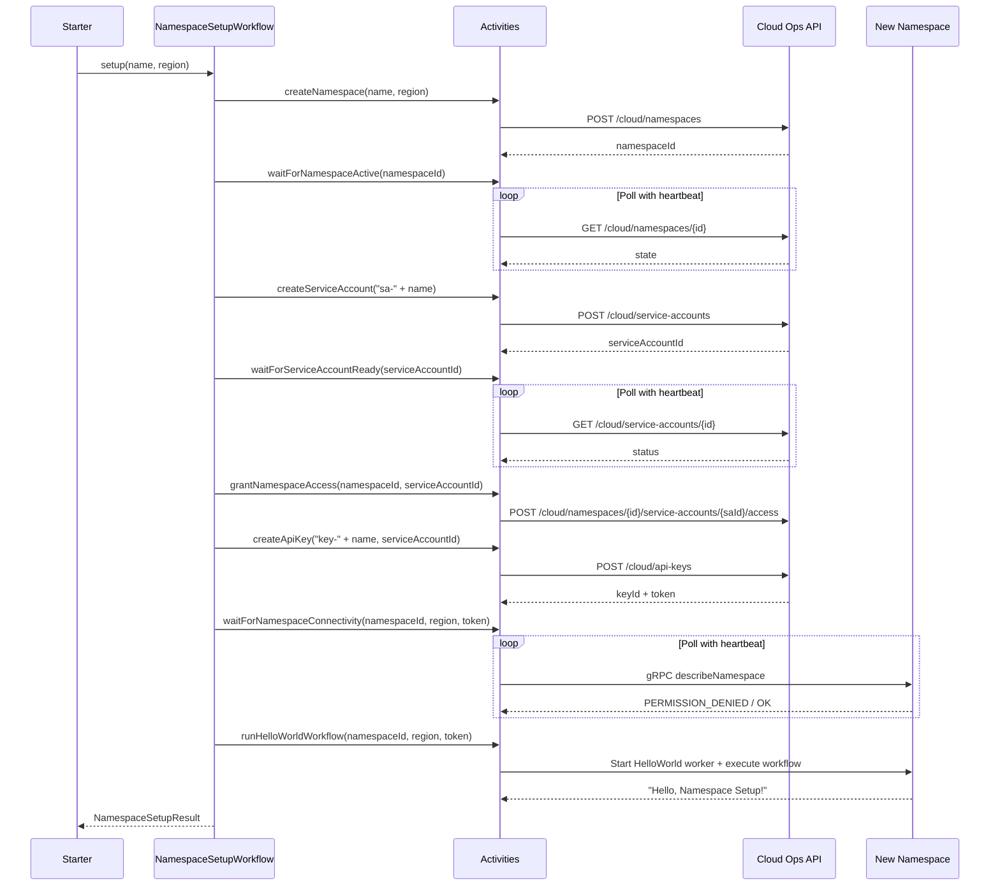

# Temporal Java SDK Showcase

A showcase project demonstrating workflow and activity patterns using the Temporal Java SDK, connected to Temporal Cloud.

## Prerequisites

| Requirement | Version |
|---|---|
| Java | 21+ |
| Gradle | Included via wrapper (`./gradlew`) |
| [Temporal Cloud](https://docs.temporal.io/cloud/get-started) | Account with an API key |

## Project Structure

```
src/main/java/io/temporal/samples/
├── activities/        # Activity interfaces + implementations
│   ├── helloworld/
│   └── namespacesetup/
├── shared/            # Shared utilities (TemporalCloudClient, TemporalCloudAdmin)
├── starters/          # Workflow starter classes (each has a main())
│   ├── helloworld/
│   ├── namespaces/
│   ├── namespacesetup/
│   └── searchattributes/
├── workers/           # Worker startup classes (each has a main())
│   ├── helloworld/
│   └── namespacesetup/
└── workflows/         # Workflow interfaces + implementations
    ├── helloworld/
    └── namespacesetup/
```

## Setup

1. Clone the repository:
   ```bash
   git clone <repo-url>
   cd temporal-java-sdk-sample
   ```

2. Create a `.env` file in the project root with your Temporal Cloud credentials:
   ```
   TEMPORAL_ADDRESS=<region>.aws.api.temporal.io:7233
   TEMPORAL_NAMESPACE=<your-namespace>.<account-id>
   TEMPORAL_API_KEY=<your-api-key>
   ```

   | Variable | Description |
   |---|---|
   | `TEMPORAL_ADDRESS` | Temporal Cloud gRPC endpoint (e.g., `us-east-1.aws.api.temporal.io:7233`) |
   | `TEMPORAL_NAMESPACE` | Your Cloud namespace in `name.accountId` format |
   | `TEMPORAL_API_KEY` | Namespace-scoped API key for gRPC auth — see [Creating API Keys](#creating-api-keys) below |

   ### Creating API Keys

   This project uses two separate API keys for different purposes:

   - **`TEMPORAL_API_KEY`** authenticates to a specific namespace over gRPC — used by workers and workflow starters (e.g., Hello World).
   - **`TEMPORAL_CLOUD_API_KEY`** authenticates to the [Cloud Operations REST API](https://docs.temporal.io/ops) for admin tasks like creating namespaces and service accounts — only needed for the Namespace Management and Namespace Setup Workflow examples.

   > Both keys can be the same key if your personal key has admin-level permissions. For production use, keep them separate (principle of least privilege).

   **Creating `TEMPORAL_API_KEY`:**

   1. Log in to [Temporal Cloud](https://cloud.temporal.io)
   2. Go to **Settings → API Keys** to create a personal API key (simplest for getting started)
   3. Click **Create API Key**, give it a name and expiry
   4. Copy the token — it is only shown once
   5. Paste the raw token into your `.env` file (no `Bearer` prefix)

   **Creating `TEMPORAL_CLOUD_API_KEY`:**

   1. Go to **Settings → API Keys** in [Temporal Cloud](https://cloud.temporal.io)
   2. Create a personal API key — your user account must have an account-level role (Admin or Developer) that grants namespace management permissions
   3. Alternatively, create a [service account](https://docs.temporal.io/cloud/service-accounts) with `ROLE_ADMIN` or `ROLE_DEVELOPER` and generate an API key for it

   See also: [API Keys docs](https://docs.temporal.io/cloud/api-keys), [Service Accounts docs](https://docs.temporal.io/cloud/service-accounts), [Cloud Access Control](https://docs.temporal.io/best-practices/cloud-access-control).

3. Load the environment variables:
   ```bash
   export $(cat .env | xargs)
   ```

## Running the Hello World

You need **two terminals** — one for the worker, one for the starter. Load env vars in both.

**Terminal 1 — Start the worker:**
```bash
export $(cat .env | xargs)
./gradlew execute -PmainClass=io.temporal.samples.workers.helloworld.HelloWorldWorker
```
You should see: `HelloWorldWorker started, polling task queue: showcase-helloworld`

**Terminal 2 — Run the starter:**
```bash
export $(cat .env | xargs)
./gradlew execute -PmainClass=io.temporal.samples.starters.helloworld.HelloWorldStarter
```
Expected output:
```
Workflow result: Hello, Temporal Cloud!
```

## Running Tests

Tests use the Temporal test framework with an in-memory server — no Cloud connection needed.

```bash
./gradlew test
```

## How It Works

The Hello World example follows the standard Temporal [workflow](https://docs.temporal.io/workflows) → [activity](https://docs.temporal.io/activities) pattern:

1. **`HelloWorldStarter`** creates a `WorkflowClient` connected to Temporal Cloud and starts the `sayHello` workflow
2. **`HelloWorldWorkflow`** receives the call and delegates to the `greet` activity
3. **`HelloWorldActivities.greet()`** returns `"Hello, <name>!"` back through the workflow
4. The starter receives the result and prints it

Key classes:

| Class | Role |
|---|---|
| `HelloWorldWorkflow` / `Impl` | Workflow interface and implementation |
| `HelloWorldActivities` / `Impl` | Activity interface and implementation |
| `HelloWorldWorker` | Registers workflow + activity, polls task queue |
| `HelloWorldStarter` | Creates and executes the workflow |
| `TemporalCloudClient` | Shared utility for Temporal Cloud API key auth |

## Namespace Management (Cloud Operations API)

This example demonstrates programmatic [namespace](https://docs.temporal.io/cloud/namespaces) creation on Temporal Cloud using the [Cloud Operations API](https://docs.temporal.io/ops). The Java SDK's `RegisterNamespace` gRPC call only works with self-hosted Temporal — for Cloud, you must use the Cloud Operations REST API. See also: [Service Accounts](https://docs.temporal.io/cloud/service-accounts), [API Keys](https://docs.temporal.io/cloud/api-keys), [Cloud Access Control](https://docs.temporal.io/best-practices/cloud-access-control), and [tcld namespace commands](https://docs.temporal.io/cloud/tcld/namespace) (CLI alternative).

**Setup:**

Add `TEMPORAL_CLOUD_API_KEY` to your `.env` file (this needs an API key with account-level admin permissions — see [Creating API Keys](#creating-api-keys). It may be the same as `TEMPORAL_API_KEY` if your key has admin access, but a separate admin-scoped key is recommended):
```
TEMPORAL_CLOUD_API_KEY=<admin-scoped-api-key>
```

**List namespaces:**
```bash
export $(cat .env | xargs)
./gradlew execute -PmainClass=io.temporal.samples.starters.namespaces.NamespaceManagerDemo \
  --args="list"
```

**Create a namespace:**
```bash
export $(cat .env | xargs)
./gradlew execute -PmainClass=io.temporal.samples.starters.namespaces.NamespaceManagerDemo \
  --args="create my-new-namespace aws-us-east-1"
```

The demo will create the namespace, then poll until it reaches `ACTIVE` state.

**Create a namespace with API key auth enabled:**
```bash
./gradlew execute -PmainClass=io.temporal.samples.starters.namespaces.NamespaceManagerDemo \
  --args="create my-new-namespace aws-us-east-1 apikey"
```

**Update a namespace (enable API key auth):**
```bash
./gradlew execute -PmainClass=io.temporal.samples.starters.namespaces.NamespaceManagerDemo \
  --args="update my-namespace.acctid enable-apikey-auth"
```

**Create a service account:**
```bash
# Default role (ROLE_READ):
./gradlew execute -PmainClass=io.temporal.samples.starters.namespaces.NamespaceManagerDemo \
  --args="create-service-account my-worker-sa"

# Explicit role:
./gradlew execute -PmainClass=io.temporal.samples.starters.namespaces.NamespaceManagerDemo \
  --args="create-service-account my-worker-sa ROLE_DEVELOPER"
```

The response will print a **service account ID** (e.g. `sa-abc123`). This is different from the display name you provided — subsequent commands (`grant-ns-access`, `create-api-key`) require this `sa-xxxxx` ID, not the display name. You can also find it in the Temporal Cloud UI under **Settings → Service Accounts**.

**Grant a service account access to a namespace:**
```bash
# Uses the sa-xxxxx ID, not the display name
./gradlew execute -PmainClass=io.temporal.samples.starters.namespaces.NamespaceManagerDemo \
  --args="grant-ns-access my-namespace.acctid sa-abc123 PERMISSION_WRITE"
```

**Create an API key for a service account:**
```bash
# Uses the sa-xxxxx ID, not the display name. Default expiry (90 days):
./gradlew execute -PmainClass=io.temporal.samples.starters.namespaces.NamespaceManagerDemo \
  --args="create-api-key worker-key sa-abc123"

# Explicit expiry:
./gradlew execute -PmainClass=io.temporal.samples.starters.namespaces.NamespaceManagerDemo \
  --args="create-api-key worker-key sa-abc123 2026-12-31T00:00:00Z"
```

**One-shot setup (namespace + service account + access + API key):**
```bash
./gradlew execute -PmainClass=io.temporal.samples.starters.namespaces.NamespaceManagerDemo \
  --args="setup my-namespace aws-us-east-1"
```

This creates a namespace with API key auth, waits for it to become ACTIVE, creates a service account, grants it `PERMISSION_WRITE` access, and creates an API key — all in one command.

**Delete a namespace:**
```bash
export $(cat .env | xargs)
./gradlew execute -PmainClass=io.temporal.samples.starters.namespaces.NamespaceManagerDemo \
  --args="delete my-namespace.acctid"
```

| Class | Role |
|---|---|
| `TemporalCloudAdmin` | HTTP client wrapper for the Cloud Operations API |
| `NamespaceManagerDemo` | Runnable demo that lists/creates/updates/deletes namespaces and manages API keys |

## Namespace Setup Workflow (Orchestration Demo)

This example reimplements the imperative `NamespaceManagerDemo.setup()` flow as a **Temporal workflow**. Each Cloud Operations API call becomes a granular activity, polling uses durable `Workflow.sleep`, and the final step connects to the newly created namespace to run a HelloWorld workflow on it.

**What it demonstrates:**
- Workflow orchestration of multi-step provisioning
- Granular activities for visibility and retryability ([activity timeouts](https://docs.temporal.io/activities#activity-timeouts), [retry policies](https://docs.temporal.io/retry-policies))
- Long-running polling with [activity heartbeating](https://docs.temporal.io/activities#activity-heartbeat)
- Durable timers with `Workflow.sleep()` for polling loops
- Dynamic Temporal client creation (connecting to a freshly provisioned namespace at runtime)

**Architecture:**


**Setup:**

Ensure both `TEMPORAL_API_KEY` (for the existing Temporal instance) and `TEMPORAL_CLOUD_API_KEY` (admin-scoped, for Cloud Operations API) are in your `.env` file.

**Terminal 1 — Start the worker:**
```bash
export $(cat .env | xargs)
./gradlew execute -PmainClass=io.temporal.samples.workers.namespacesetup.NamespaceSetupWorker
```

**Terminal 2 — Run the starter:**
```bash
export $(cat .env | xargs)
./gradlew execute -PmainClass=io.temporal.samples.starters.namespacesetup.NamespaceSetupStarter \
  --args="my-test-ns aws-us-east-1"
```

Expected output:
```
=== Namespace Setup Complete ===
  Namespace:       my-test-ns.acctid
  Service Account: sa-abc123
  API Key ID:      key-xyz789
  HelloWorld:      Hello, Namespace Setup!
```

You can watch the workflow in the Temporal Web UI — each activity is visible as a separate event in the workflow history.

| Class | Role |
|---|---|
| `NamespaceSetupWorkflow` / `Impl` | Orchestration workflow — sequences all steps with durable sleep |
| `NamespaceSetupActivities` / `Impl` | Granular activities — one per Cloud API call + HelloWorld runner |
| `NamespaceSetupWorker` | Registers workflow + activities, polls task queue |
| `NamespaceSetupStarter` | Creates and executes the setup workflow |

## Search Attributes (Cloud Operations API)

This example demonstrates managing custom [search attributes](https://docs.temporal.io/visibility#search-attribute) on Temporal Cloud using the Cloud Operations API.

**Why not `OperatorService`?**

The Java SDK's `OperatorService.addSearchAttributes()` is **not supported on Temporal Cloud** — it only works with self-hosted Temporal Server. Even if the `NullPointerException` from standalone `OperatorServiceStubs` is fixed (by deriving it from an existing `WorkflowServiceStubs` via `setChannel(service.getRawChannel())`), Cloud returns `PERMISSION_DENIED`. For Temporal Cloud, search attributes must be managed via the Cloud Operations API's `UpdateNamespace` endpoint, which is what this demo implements.

> **Self-hosted workaround:** If you're using self-hosted Temporal and hit a `NullPointerException` (`scope is null` in `GrpcMetricsInterceptor`), create `OperatorServiceStubs` from an existing `WorkflowServiceStubs`:
> ```java
> OperatorServiceStubs operatorService = OperatorServiceStubs.newServiceStubs(
>     OperatorServiceStubsOptions.newBuilder()
>         .setChannel(workflowServiceStubs.getRawChannel())
>         .validateAndBuildWithDefaults());
> ```

**Setup:**

Requires `TEMPORAL_CLOUD_API_KEY` (same as namespace management — see [Creating API Keys](#creating-api-keys)):
```
TEMPORAL_CLOUD_API_KEY=<admin-scoped-api-key>
```

**List search attributes on a namespace:**
```bash
export $(cat .env | xargs)
./gradlew execute -PmainClass=io.temporal.samples.starters.searchattributes.SearchAttributeDemo \
  --args="list my-ns.acctid"
```

- `list` — the command
- `my-ns.acctid` — the full namespace ID in `name.accountId` format (same format shown in the Temporal Cloud UI)

**Add search attributes:**
```bash
export $(cat .env | xargs)
./gradlew execute -PmainClass=io.temporal.samples.starters.searchattributes.SearchAttributeDemo \
  --args="add my-ns.acctid app_id=Keyword customer_name=Text priority=Int"
```

- `add` — the command
- `my-ns.acctid` — the full namespace ID
- `app_id=Keyword customer_name=Text priority=Int` — one or more `name=type` pairs, space-separated. Each pair creates a search attribute with the given name and [type](https://docs.temporal.io/visibility#supported-types).

Adding is **additive** — new attributes are merged with any existing ones on the namespace. Existing attributes are not modified or removed.

**Supported [search attribute types](https://docs.temporal.io/visibility#supported-types):**

| Type | Description | Example values |
|---|---|---|
| `Keyword` | Exact-match string — for IDs, enums, status codes | `"pending"`, `"us-east-1"` |
| `Text` | Full-text searchable string | `"Error processing payment"` |
| `Int` | Integer number | `1`, `42`, `100` |
| `Double` | Floating-point number | `3.14`, `99.95` |
| `Bool` | Boolean flag | `true`, `false` |
| `Datetime` | Timestamp ([RFC 3339](https://datatracker.ietf.org/doc/html/rfc3339)) | `"2026-03-10T12:00:00Z"` |
| `KeywordList` | List of exact-match strings (multi-value) | `["urgent", "billing"]` |

**Constraints:**
- [Limited number](https://docs.temporal.io/cloud/limits#number-of-custom-search-attributes) of custom search attributes per type per namespace on Cloud
- Deleting a search attribute is not supported — contact [Temporal support](https://support.temporal.io) to remove one
- Renaming is supported via [`tcld namespace search-attributes rename`](https://docs.temporal.io/cloud/tcld/namespace#rename) (not implemented in this demo)
- Short propagation delay (~seconds) after creation before the attribute is usable in queries

See also: [Custom Search Attributes](https://docs.temporal.io/visibility#custom-search-attributes), [Search Attribute limits](https://docs.temporal.io/cloud/limits#number-of-custom-search-attributes), [Cloud Operations API](https://docs.temporal.io/ops), [`tcld namespace search-attributes`](https://docs.temporal.io/cloud/tcld/namespace#search-attributes).

| Class | Role |
|---|---|
| `SearchAttributeDemo` | CLI demo — list and add search attributes on a namespace |
| `TemporalCloudAdmin` | HTTP client wrapper for the [Cloud Operations API](https://docs.temporal.io/ops) |

## Concepts Roadmap

- [x] Basic workflow + activity (Hello World)
- [x] Programmatic namespace management (Cloud Operations API)
- [x] Custom search attributes (Cloud Operations API)
- [ ] Long-running workflows with heartbeating
- [ ] Child workflows
- [ ] Signals and Queries
- [ ] Updates (and UpdateWithStart)
- [ ] Schedules
- [ ] Worker Versioning
- [ ] Saga / compensation pattern
- [ ] Timers and `Workflow.sleep()`
- [ ] Side effects and `MutableSideEffect`
- [ ] Custom data converters
- [ ] OpenTelemetry interceptors

## References

- [Temporal Cloud Guide](https://docs.temporal.io/cloud)
- [Cloud Operations API](https://docs.temporal.io/ops)
- [Cloud Namespaces](https://docs.temporal.io/cloud/namespaces)
- [Service Accounts](https://docs.temporal.io/cloud/service-accounts)
- [API Keys](https://docs.temporal.io/cloud/api-keys)
- [Cloud Access Control](https://docs.temporal.io/best-practices/cloud-access-control)
- [Workflows](https://docs.temporal.io/workflows)
- [Activities](https://docs.temporal.io/activities)
- [Retry Policies](https://docs.temporal.io/retry-policies)
- [Namespaces](https://docs.temporal.io/namespaces)
- [Temporal Java SDK](https://docs.temporal.io/develop/java)
